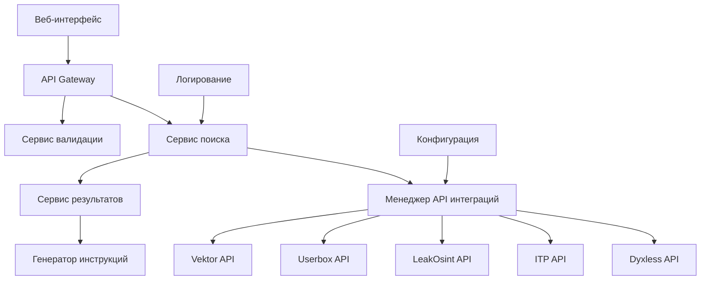

# Документ дизайна

## Обзор

Система удаления личной информации из телеграм ботов представляет собой веб-приложение, которое интегрируется с 5 различными API для поиска персональных данных пользователей. Архитектура построена на принципах безопасности, производительности и масштабируемости.

## Архитектура

### Высокоуровневая архитектура



### Технологический стек

- **Backend**: Node.js с Express.js
- **Frontend**: React.js с TypeScript
- **Валидация**: Joi или Yup для валидации входных данных
- **HTTP клиент**: Axios для API запросов
- **Логирование**: Winston
- **Конфигурация**: dotenv для переменных окружения

## Компоненты и интерфейсы

### 1. Веб-интерфейс (Frontend)

#### Компоненты:
- **SearchForm**: Форма ввода персональных данных
- **ResultsDisplay**: Отображение результатов поиска
- **InstructionsPage**: Страница с инструкциями по удалению
- **TariffInfo**: Информация о тарифах (заглушка)

#### Интерфейсы:
```typescript
interface SearchRequest {
  type: 'phone' | 'email' | 'inn' | 'snils' | 'passport';
  value: string;
}

interface SearchResult {
  botId: string;
  botName: string; // зашифрованное название
  foundData: FoundDataItem[];
  hasData: boolean;
}

interface FoundDataItem {
  field: string;
  value: string;
  source?: string;
}
```

### 2. API Gateway

Центральная точка входа для всех запросов от фронтенда.

#### Эндпоинты:
- `POST /api/search` - Поиск по всем ботам
- `GET /api/instructions/:botId` - Получение инструкций для конкретного бота
- `GET /api/tariffs` - Информация о тарифах

### 3. Сервис поиска (SearchService)

Координирует поиск по всем API и агрегирует результаты.

```typescript
class SearchService {
  async searchAllBots(request: SearchRequest): Promise<SearchResult[]>
  private async executeParallelSearch(request: SearchRequest): Promise<RawApiResult[]>
  private aggregateResults(results: RawApiResult[]): SearchResult[]
}
```

### 4. Менеджер API интеграций (ApiManager)

Управляет подключениями к различным API ботов.

```typescript
interface BotApiClient {
  search(query: string, type: SearchType): Promise<ApiResponse>;
  isAvailable(): Promise<boolean>;
}

class ApiManager {
  private clients: Map<string, BotApiClient>;
  async searchAll(request: SearchRequest): Promise<Map<string, ApiResponse>>;
}
```

### 5. Клиенты API ботов

#### DyxlessClient
```typescript
class DyxlessClient implements BotApiClient {
  private baseUrl = 'https://api-dyxless.cfd';
  private token = process.env.DYXLESS_TOKEN;
  
  async search(query: string): Promise<ApiResponse> {
    // POST /query с параметрами token и query
  }
}
```

#### ITPClient
```typescript
class ITPClient implements BotApiClient {
  private baseUrl = 'https://datatech.work';
  private apiKey = process.env.ITP_TOKEN;
  
  async search(query: string, type: SearchType): Promise<ApiResponse> {
    // POST /public-api/data/search с заголовком x-api-key
  }
}
```

#### LeakOsintClient
```typescript
class LeakOsintClient implements BotApiClient {
  private baseUrl = 'https://leakosintapi.com';
  private token = process.env.LEAK_OSINT_TOKEN;
  
  async search(query: string): Promise<ApiResponse> {
    // POST / с JSON данными
  }
}
```

#### UserboxClient
```typescript
class UserboxClient implements BotApiClient {
  private baseUrl = 'https://api.usersbox.ru/v1';
  private token = process.env.USERBOX_TOKEN;
  
  async search(query: string): Promise<ApiResponse> {
    // GET /search с заголовком Authorization
  }
}
```

#### VektorClient
```typescript
class VektorClient implements BotApiClient {
  private baseUrl = 'https://infosearch54321.xyz';
  private token = process.env.VEKTOR_TOKEN;
  
  async search(query: string): Promise<ApiResponse> {
    // GET /api/{token}/extended_search/{query}
  }
}
```

## Модели данных

### Входные данные
```typescript
interface UserInput {
  searchType: 'phone' | 'email' | 'inn' | 'snils' | 'passport';
  searchValue: string;
}
```

### Результаты поиска
```typescript
interface SearchResults {
  searchId: string;
  timestamp: Date;
  results: BotResult[];
  totalBotsSearched: number;
  totalBotsWithData: number;
}

interface BotResult {
  botId: string;
  encryptedName: string; // "Бот A", "Бот B", etc.
  status: 'success' | 'error' | 'no_data';
  foundFields: DataField[];
  errorMessage?: string;
}

interface DataField {
  fieldName: string;
  fieldValue: string;
  confidence?: number;
}
```

### Конфигурация ботов
```typescript
interface BotConfig {
  id: string;
  name: string;
  encryptedName: string;
  apiClient: string;
  isActive: boolean;
  priority: number;
}
```

## Обработка ошибок

### Стратегия обработки ошибок
1. **Graceful degradation**: Если один API недоступен, продолжаем с остальными
2. **Retry mechanism**: Повторные попытки для временных сбоев
3. **Circuit breaker**: Отключение недоступных API на время
4. **Подробное логирование**: Все ошибки логируются для анализа

### Типы ошибок
```typescript
enum ErrorType {
  API_UNAVAILABLE = 'api_unavailable',
  INVALID_TOKEN = 'invalid_token',
  RATE_LIMIT = 'rate_limit',
  VALIDATION_ERROR = 'validation_error',
  NETWORK_ERROR = 'network_error'
}
```

## Стратегия тестирования

### Unit тесты
- Тестирование каждого API клиента отдельно
- Тестирование валидации входных данных
- Тестирование агрегации результатов

### Integration тесты
- Тестирование полного потока поиска
- Тестирование обработки ошибок API
- Тестирование параллельных запросов

### E2E тесты
- Тестирование пользовательских сценариев
- Тестирование UI компонентов
- Тестирование генерации инструкций

### Тестовые данные
```typescript
const testData = {
  validPhone: '+79123456789',
  validEmail: 'test@example.com',
  validINN: '123456789012',
  validSNILS: '12345678901',
  validPassport: '1234 567890'
};
```

## Безопасность

### Защита персональных данных
1. **Отсутствие постоянного хранения**: Данные не сохраняются в БД
2. **Шифрование в памяти**: Чувствительные данные шифруются
3. **Очистка памяти**: Принудительная очистка после обработки
4. **Логирование без PII**: Логи не содержат персональные данные

### Валидация и санитизация
```typescript
const validationSchemas = {
  phone: Joi.string().pattern(/^\+?[1-9]\d{1,14}$/),
  email: Joi.string().email(),
  inn: Joi.string().pattern(/^\d{10,12}$/),
  snils: Joi.string().pattern(/^\d{11}$/),
  passport: Joi.string().pattern(/^\d{4}\s?\d{6}$/)
};
```

### Rate limiting
- Ограничение запросов с одного IP
- Защита от DDoS атак
- Мониторинг подозрительной активности

## Производительность

### Оптимизации
1. **Параллельные запросы**: Все API вызываются одновременно
2. **Кэширование**: Кэширование конфигурации ботов
3. **Connection pooling**: Переиспользование HTTP соединений
4. **Timeout management**: Разумные таймауты для API

### Мониторинг
- Время ответа каждого API
- Успешность запросов
- Использование памяти
- Нагрузка на систему

## Конфигурация

### Переменные окружения
```env
# API Tokens
DYXLESS_TOKEN=38a634df-2317-4c8c-beb7-7ca4fd97f1e1
LEAK_OSINT_TOKEN=466496291:r571DgY3
USERBOX_TOKEN=eyJhbGciOiJIUzI1NiIsInR5cCI6IkpXVCJ9...
VEKTOR_TOKEN=C45vAVuDkzNax2BF4sz8o4KEAZFBIIK
ITP_TOKEN=91b2c57abce2ca84f8ca068df2eda054

# API URLs
ITP_BASE_URL=https://datatech.work
DYXLESS_BASE_URL=https://api-dyxless.cfd
LEAK_OSINT_BASE_URL=https://leakosintapi.com
USERBOX_BASE_URL=https://api.usersbox.ru/v1
VEKTOR_BASE_URL=https://infosearch54321.xyz

# App Configuration
PORT=3000
NODE_ENV=production
LOG_LEVEL=info
REQUEST_TIMEOUT=30000
MAX_CONCURRENT_REQUESTS=5
```

### Конфигурация ботов
```json
{
  "bots": [
    {
      "id": "dyxless",
      "name": "Dyxless",
      "encryptedName": "Бот A",
      "isActive": true,
      "priority": 1
    },
    {
      "id": "itp",
      "name": "InfoTrackPeople",
      "encryptedName": "Бот B",
      "isActive": true,
      "priority": 2
    },
    {
      "id": "leak_osint",
      "name": "LeakOsint",
      "encryptedName": "Бот C",
      "isActive": true,
      "priority": 3
    },
    {
      "id": "userbox",
      "name": "Userbox",
      "encryptedName": "Бот D",
      "isActive": true,
      "priority": 4
    },
    {
      "id": "vektor",
      "name": "Vektor",
      "encryptedName": "Бот E",
      "isActive": true,
      "priority": 5
    }
  ]
}
```

## Инструкции по удалению

### Шаблон инструкций
```typescript
interface DeletionInstruction {
  botId: string;
  encryptedName: string;
  steps: InstructionStep[];
}

interface InstructionStep {
  stepNumber: number;
  description: string;
  action?: string;
  screenshot?: string;
}
```

### Пример инструкций
```json
{
  "botId": "bot_a",
  "encryptedName": "Бот A",
  "steps": [
    {
      "stepNumber": 1,
      "description": "Для того чтобы удалить данные вам нужно активировать бота \"Бот A\""
    },
    {
      "stepNumber": 2,
      "description": "Выбрать раздел \"мой профиль\" - \"удалить информацию обо мне\""
    }
  ]
}
```

## Масштабируемость

### Горизонтальное масштабирование
- Stateless архитектура
- Load balancer для распределения нагрузки
- Микросервисная архитектура для будущего развития

### Вертикальное масштабирование
- Оптимизация использования памяти
- Эффективное управление соединениями
- Профилирование производительности

## Мониторинг и логирование

### Метрики
- Количество поисковых запросов
- Время ответа каждого API
- Процент успешных запросов
- Использование ресурсов

### Логирование
```typescript
const logger = winston.createLogger({
  level: 'info',
  format: winston.format.combine(
    winston.format.timestamp(),
    winston.format.errors({ stack: true }),
    winston.format.json()
  ),
  transports: [
    new winston.transports.File({ filename: 'error.log', level: 'error' }),
    new winston.transports.File({ filename: 'combined.log' })
  ]
});
```

## Подготовка к монетизации

### Архитектурные решения
1. **Middleware для проверки подписки**: Готовность к интеграции платежей
2. **Система тарифов**: Гибкая конфигурация планов
3. **Учет использования**: Подсчет запросов и лимитов
4. **Интеграция с платежными системами**: Заготовки для Stripe/PayPal

### Структура тарифов
```typescript
interface TariffPlan {
  id: string;
  name: string;
  price: number;
  currency: string;
  searchLimit: number;
  features: string[];
  isActive: boolean;
}
```