# Design Document

## Overview

This design addresses the systematic resolution of Railway deployment failures for the DataTrace application. The primary issue is Docker build context problems where npm ci cannot locate package-lock.json files, leading to build failures. The solution involves Docker optimization, Railway configuration improvements, and alternative deployment strategies.

## Architecture

### Current Problem Analysis

```mermaid
graph TD
    A[Railway Deployment] --> B[Docker Build Context: Root Directory]
    B --> C[Dockerfile: backend/Dockerfile]
    C --> D[COPY package*.json ./]
    D --> E[Looking for package.json in root/]
    E --> F[❌ package-lock.json not found]
    F --> G[npm ci fails with EUSAGE error]
    G --> H[Build fails with exit code 137]
```



### Proposed Solution Architecture


## Components and Interfaces

### 1. Docker Build Optimization Component

**Purpose**: Fix Docker build context and optimize for Railway's infrastructure

**Key Features**:
- Correct file path resolution for build context
- Memory-efficient npm operations
- Multi-stage build optimization
- Error handling and fallback strategies

**Interface**:
```dockerfile
# Build stage with correct paths
FROM node:18-alpine AS builder
WORKDIR /app
COPY backend/package*.json ./
RUN npm ci --prefer-offline --no-audit --no-fund
COPY backend/ .
RUN npm run build

# Production stage
FROM node:18-alpine AS production
# ... optimized production setup
```

### 2. Railway Configuration Component

**Purpose**: Optimize Railway deployment settings and configuration

**Key Features**:
- Correct dockerfilePath specification
- Build timeout and memory settings
- Environment variable configuration
- Health check optimization

**Interface**:
```toml
[build]
builder = "DOCKERFILE"
dockerfilePath = "backend/Dockerfile"
buildCommand = "npm run build"

[deploy]
startCommand = "npm start"
healthcheckPath = "/health"
healthcheckTimeout = 300
restartPolicyType = "ON_FAILURE"
restartPolicyMaxRetries = 10
```

### 3. Alternative Deployment Strategy Component

**Purpose**: Provide backup deployment options if Docker builds fail

**Key Features**:
- Railway Buildpack deployment
- Alternative cloud platform configurations
- Environment variable migration
- Deployment strategy switching

**Interface**:
```javascript
// Buildpack deployment configuration
{
  "engines": {
    "node": "18.x",
    "npm": "8.x"
  },
  "scripts": {
    "build": "tsc --project tsconfig.build.json",
    "start": "node dist/index.js"
  }
}
```

### 4. Build Monitoring Component

**Purpose**: Monitor and debug build processes for continuous improvement

**Key Features**:
- Build step logging and analysis
- Resource usage monitoring
- Error pattern detection
- Performance optimization tracking

**Interface**:
```javascript
// Build monitoring hooks
const buildMonitor = {
  logBuildStep: (step, status, duration) => {},
  trackResourceUsage: (memory, cpu) => {},
  analyzeFailurePattern: (error) => {},
  optimizeBuildProcess: (metrics) => {}
};
```

## Data Models

### Build Configuration Model

```typescript
interface BuildConfiguration {
  strategy: 'docker' | 'buildpack' | 'alternative';
  dockerfilePath?: string;
  buildContext: string;
  memoryLimit: number;
  timeoutSeconds: number;
  environmentVariables: Record<string, string>;
  optimizations: {
    npmCache: boolean;
    offlineFirst: boolean;
    skipAudit: boolean;
    skipFunding: boolean;
  };
}
```

### Deployment Status Model

```typescript
interface DeploymentStatus {
  id: string;
  strategy: string;
  status: 'pending' | 'building' | 'deploying' | 'success' | 'failed';
  buildLogs: string[];
  errorMessages: string[];
  resourceUsage: {
    memory: number;
    cpu: number;
    buildTime: number;
  };
  healthCheck: {
    status: 'healthy' | 'unhealthy';
    endpoint: string;
    responseTime: number;
  };
}
```

## Error Handling

### Docker Build Failures

1. **Package Lock File Missing**:
   - Verify file paths in Dockerfile
   - Check .dockerignore exclusions
   - Implement fallback to npm install if npm ci fails

2. **Memory Exhaustion (Exit Code 137)**:
   - Optimize npm configuration for memory usage
   - Implement build step chunking
   - Use npm ci with memory-efficient flags

3. **Build Context Issues**:
   - Validate file copying paths
   - Implement build context debugging
   - Provide clear error messages for path issues

### Railway Platform Issues

1. **Timeout Failures**:
   - Increase build timeout settings
   - Optimize build process for speed
   - Implement build step parallelization where possible

2. **Resource Constraints**:
   - Monitor resource usage during builds
   - Implement resource-aware build strategies
   - Use Railway's build optimization features

### Fallback Strategies

1. **Buildpack Deployment**:
   - Switch to Railway's Node.js buildpack
   - Maintain same environment configuration
   - Preserve application functionality

2. **Alternative Platforms**:
   - Prepare Vercel configuration
   - Set up Heroku deployment option
   - Configure DigitalOcean App Platform

## Testing Strategy

### Build Process Testing

1. **Local Docker Testing**:
   - Test Dockerfile builds locally with same context
   - Verify package-lock.json accessibility
   - Validate multi-stage build process

2. **Railway Build Simulation**:
   - Replicate Railway's build environment locally
   - Test with same Node.js version and Alpine Linux
   - Validate build context and file paths

3. **Alternative Strategy Testing**:
   - Test buildpack deployment locally
   - Verify alternative platform configurations
   - Validate environment variable handling

### Deployment Validation

1. **Health Check Testing**:
   - Verify application starts correctly
   - Test health endpoint functionality
   - Validate port binding and networking

2. **Functionality Testing**:
   - Test all API endpoints
   - Verify database connections
   - Validate external service integrations

3. **Performance Testing**:
   - Monitor application startup time
   - Test response times under load
   - Validate resource usage in production

### Monitoring and Alerting

1. **Build Monitoring**:
   - Track build success/failure rates
   - Monitor build duration trends
   - Alert on repeated failures

2. **Deployment Monitoring**:
   - Monitor application health
   - Track deployment frequency
   - Alert on deployment failures

3. **Performance Monitoring**:
   - Monitor response times
   - Track error rates
   - Monitor resource utilization

## Implementation Phases

### Phase 1: Docker Build Fix
- Fix Dockerfile paths and context issues
- Optimize npm operations for Railway
- Test build process locally and on Railway

### Phase 2: Railway Configuration Optimization
- Update railway.toml with optimal settings
- Configure environment variables
- Implement health checks

### Phase 3: Alternative Deployment Setup
- Configure buildpack deployment option
- Set up alternative platform accounts
- Test deployment switching process

### Phase 4: Monitoring and Optimization
- Implement build monitoring
- Set up alerting for failures
- Optimize based on performance metrics

This design provides a comprehensive approach to resolving Railway deployment issues while ensuring reliable production deployment of the DataTrace application.